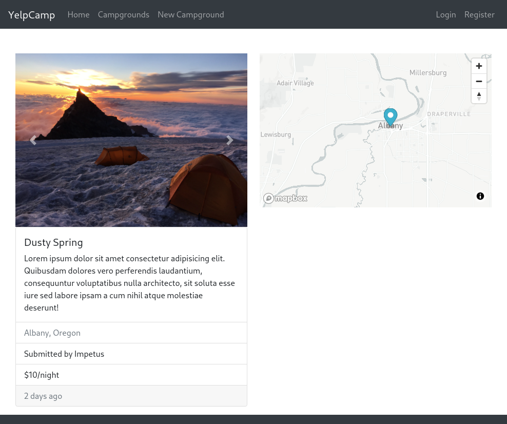

# YelpCamp

> campground rating sites built using express mongo from colt steels bootcamp

# demo

[heroku](lit-dusk-16748.herokuapp.com)

# Features

- CRUD opration with campground
- Add review and rating to campground
- Integrated mapbox and cloudinary

# Library used

- express
- mapbox
- cloudinary
- ejs
- express-mongo-sanitize
- express-session
- multer

# Deploy

`npm start`

# Env variable

| variable              | Usage        |
| --------------------- | ------------ |
| CLOUDINARY_KEY        | image upload |
| CLOUDINARY_SECRET     | image upload |
| CLOUDINARY_CLOUD_NAME | image upload |
| MAPBOX_TOKEN          | map usage    |
| DB_URL                | mongodb url  |
